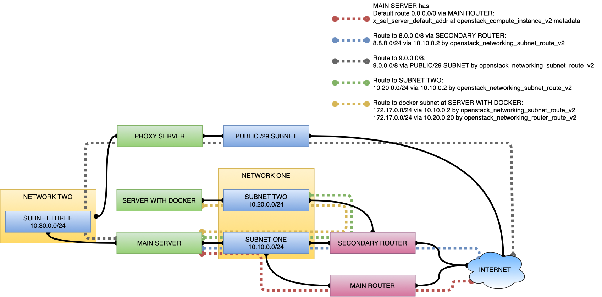

# Routing test environment

This environment will create a Selectel VPC user and project with multiple servers, routers, networks, subnets, routes at routers and subnets.

## Example usage

```sh
terraform init

env \
  TF_VAR_sel_token=xxx_yyy \
  TF_VAR_user_password=secret \
  terraform apply
```

## OR use secrets.tfvars

```sh
  terraform apply -var-file secrets.tfvars
```

## Check routes
```sh
ssh -J root@$(terraform output -raw proxy_server_ip) root@$(terraform output -raw main_server_ip) route -n
```

## Scheme



## Outputs

  * `main_server_ip` - IP address of the main server.

  * `proxy_server_ip` - IP address of the proxy server.
